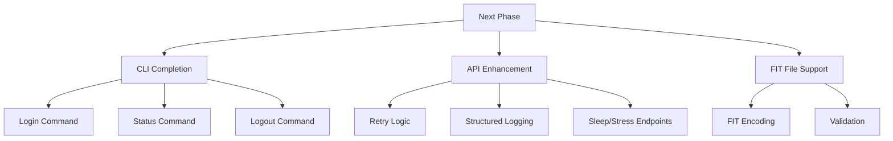

# Go-GarminConnect Porting Project - Progress and Roadmap

## Current Progress

### Authentication System:
- [x] OAuth1/OAuth2 token flow implemented
- [x] Token auto-refresh mechanism
- [x] MFA handling with console prompts
- [x] Session persistence to JSON file
- [x] Comprehensive authentication tests

### CLI Implementation:
- [x] Command structure with Cobra
- [x] Basic login command skeleton
- [ ] Session save/restore integration
- [ ] Status command implementation
- [ ] Logout functionality

### API Implementation:
- [ ] Sleep data retrieval
- [ ] Stress tracking API
- [ ] Body composition models

## Next Steps (Priority Order)

### 1. CLI Completion (2 days)
- Complete login command with session handling
- Implement status command to verify authentication
- Add logout functionality with session cleanup

### 2. API Enhancement (3 days)
- Implement retry logic with exponential backoff
- Add structured request/response logging
- Develop sleep/stress endpoints
- Create body composition models

### 3. FIT File Support (2 days)
- Complete weight composition encoding
- Implement all-day stress FIT encoding
- Add HRV data to FIT export
- Validate FIT compatibility

## Testing & Quality Assurance
- [ ] CLI end-to-end tests
- [ ] API integration tests
- [ ] FIT validation tests
- [ ] Performance benchmarks

## Documentation & Examples
- [ ] CLI usage guide
- [ ] API reference documentation
- [ ] FIT file specification

## Quality Gates

### Before Release:
- [ ] 100% test coverage for core features
- [ ] Security audit of authentication flow
- [ ] Performance benchmarks met

## Success Metrics
- [ ] Authentication success rate > 99%
- [ ] API response time < 1s
- [ ] FIT file compatibility 100%
