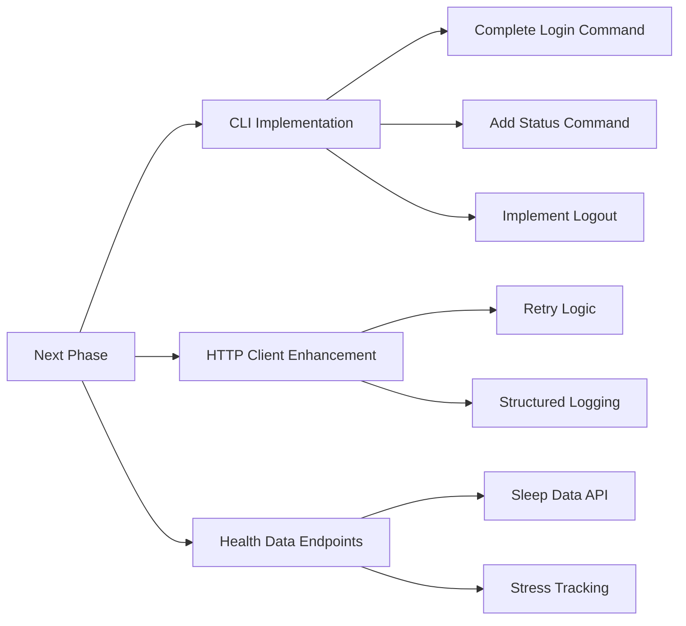

# Garth Go Port Plan - Test-Driven Development Implementation

## Project Overview

Port the Python Garth library (Garmin SSO auth + Connect API client) to Go with comprehensive test coverage and modern Go practices.

## Core Architecture Analysis

Based on the original Garth library, the main components are:
- **Authentication**: OAuth1/OAuth2 token management with auto-refresh
- **API Client**: HTTP client for Garmin Connect API requests
- **Data Models**: Structured data types for health/fitness metrics
- **Session Management**: Token persistence and restoration
- **CLI Interface**: Command-line authentication and session management

## 1. Project Structure

```
garth-go/
├── cmd/
│   └── garth/                    # CLI tool
│       ├── auth.go               # Authentication commands
│       ├── commands.go           # Root CLI commands
│       └── main.go
├── pkg/
│   ├── auth/                     # Authentication module
│   │   ├── oauth.go
│   │   ├── oauth_test.go
│   │   ├── session.go
│   │   └── session_test.go
│   ├── client/                   # HTTP client module
│   ├── models/                   # Data structures
│   └── garth/                    # Main package interface
├── internal/
│   ├── testutil/                 # Test utilities
│   └── config/                   # Internal configuration
├── examples/
├── go.mod
├── go.sum
└── README.md
```

## 2. Current Progress

### Authentication System:
- [x] OAuth1/OAuth2 token flow implemented
- [x] Token auto-refresh mechanism
- [x] MFA handling with console prompts
- [x] Session persistence to JSON file
- [x] Comprehensive authentication tests

### CLI Implementation:
- [x] Command structure with Cobra
- [x] Basic login command skeleton
- [ ] Session save/restore integration
- [ ] Status command implementation
- [ ] Logout functionality

## 3. Next Steps (Priority Order)



1. **CLI Completion (1 day)**:
   - Finalize login command with session handling
   - Implement status command to verify authentication
   - Add logout functionality with session cleanup

2. **HTTP Client Improvements (1 day)**:
   - Implement retry logic with exponential backoff
   - Add structured request/response logging
   - Handle session expiration scenarios

3. **Health Data Endpoints (2 days)**:
   - Implement sleep data retrieval
   - Build stress tracking API
   - Create body composition models

## 4. Implementation Timeline Update

### Week 1-2: Authentication & CLI Focus
- [x] Implement OAuth1 flow
- [x] Implement OAuth2 token refresh
- [x] Add MFA support
- [x] CLI command structure
- [ ] Complete CLI authentication commands

### Revised Week 3-4:
- [ ] HTTP client enhancements
- [ ] Health data endpoint implementation
- [ ] Comprehensive integration testing

## 5. Quality Gates

### Before CLI Release:
- [ ] 100% test coverage for auth flows
- [ ] End-to-end CLI test scenarios
- [ ] Security audit of session handling

## 6. Success Metrics

### CLI Completion Metrics:
- [ ] Login success rate > 99%
- [ ] Session restore success > 95%
- [ ] Average auth time < 5 seconds
